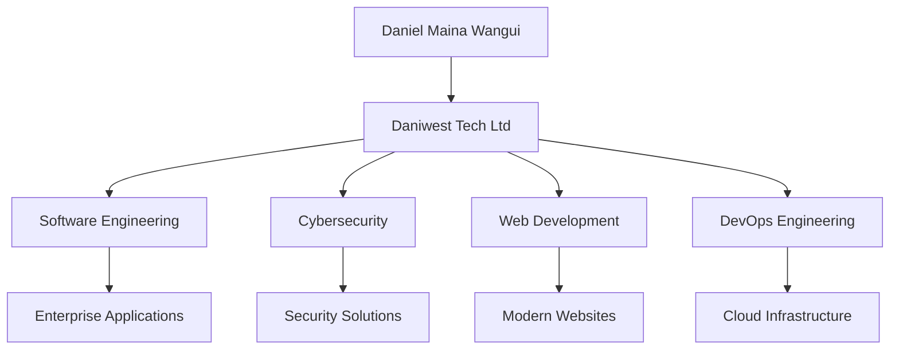
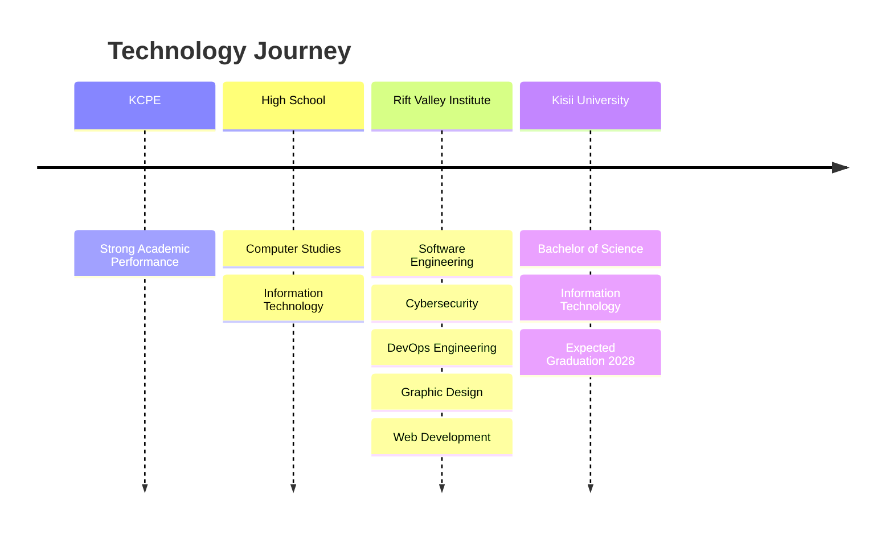
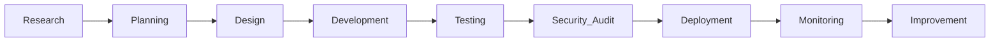

<div align="center">

# DANIEL MAINA WANGUI


<br>


<br><br>

[](https://daniwesttechnologies.vercel.app)

[](https://www.justiceultimateautomobiles.com)

[](https://justicecoporatelogisticskenya.vercel.app)

</div>

---

## SYSTEM OVERVIEW



---

## EDUCATION ROADMAP



---

## TECHNOLOGY STACK

### Programming Languages


---

### Frontend Development


---

### Backend Development


---

### Mobile App Development


---

### Databases


---

### DevOps & Cloud


---

### Cybersecurity


---

### Design Tools


### Cybersecurity


---

## ORGANIZATIONS

| Organization                      | Focus Area                           | Website                                          |
| --------------------------------- | ------------------------------------ | ------------------------------------------------ |
| Daniwest Tech Ltd                 | Software Engineering & Cybersecurity | https://daniwesttechnologies.vercel.app          |
| Justice Ultimate Automobiles      | Automotive Solutions                 | https://www.justiceultimateautomobiles.com       |
| Justice Corporate Logistics Kenya | Logistics & Transport Solutions      | https://justicecoporatelogisticskenya.vercel.app |

---

## DEVELOPMENT PIPELINE



---

## GITHUB STATISTICS


---

## CURRENT OBJECTIVES

```text
[ ACTIVE PROJECTS ]

■ Enterprise Software Development
■ Cybersecurity Research
■ DevOps Engineering
■ Cloud Infrastructure
■ Artificial Intelligence
■ Digital Transformation
■ Business Automation

STATUS: ACTIVE
```

---

<div align="center">

### DANIWEST TECH LTD

Building Secure • Scalable • Innovative Digital Solutions

© 2026 Daniwest Tech Ltd

</div>

# DANIEL MAINA WANGUI

### Information Technology Student | Software Engineer | Cybersecurity Enthusiast | Web Developer | Graphic Designer

```bash
┌──(root㉿parrot)-[~/portfolio]
└─$ initializing_profile.sh

[✓] Loading developer profile...
[✓] Connecting to secure network...
[✓] Loading cybersecurity modules...
[✓] Loading software engineering toolkit...
[✓] Loading DevOps environment...
[✓] Loading digital innovation workspace...

System Ready...
```

```bash
┌──(root㉿parrot)-[~/portfolio]
└─$ whoami

Daniel Maina Wangui

┌──(root㉿parrot)-[~/portfolio]
└─$ cat role.txt

Information Technology Student
Software Engineer
Cybersecurity Enthusiast
Web Developer
Graphic Designer

┌──(root㉿parrot)-[~/portfolio]
└─$ _
```

```text
███████████████████████████████████████████████████████████████████
█ 01001000 01000001 01000011 01001011 01000101 01010010 01010011 █
█ 01110011 01100101 01100011 01110101 01110010 01100101 00100000 █
█ 01110011 01111001 01110011 01110100 01100101 01101101 01110011 █
███████████████████████████████████████████████████████████████████
```

---

# PROFILE

```bash
┌──(root㉿parrot)-[~/profile]
└─$ cat about_me.txt

Technology-driven student and developer currently pursuing
a Bachelor of Science in Information Technology at Kisii University.

Passionate about:
• Software Engineering
• Cybersecurity
• DevOps Engineering
• Cloud Technologies
• Graphic Design
• Networking
• Enterprise Systems Development

Mission:
Build secure, scalable and innovative digital solutions
that solve real-world business challenges.
```

---

# TECHNOLOGY STACK

## Software Development

```bash
┌──(root㉿parrot)-[~/skills/software]
└─$ ls

HTML5
CSS3
JavaScript
PHP
Python
C Programming
MySQL
Bootstrap
Git
GitHub
```

## Cybersecurity

```bash
┌──(root㉿parrot)-[~/skills/cybersecurity]
└─$ ls

Network Security
Ethical Hacking
Penetration Testing
Digital Forensics
Security Auditing
Vulnerability Assessment
```

## DevOps & Cloud

```bash
┌──(root㉿parrot)-[~/skills/devops]
└─$ ls

Linux
Git
GitHub Actions
CI/CD
Server Management
Cloud Deployment
System Administration
```

## Design

```bash
┌──(root㉿parrot)-[~/skills/design]
└─$ ls

Adobe Photoshop
Adobe Illustrator
Canva
UI/UX Design
Brand Identity
Digital Marketing Assets
```

---

# EDUCATION ROADMAP

```text
[BOOT SEQUENCE INITIATED]

KCPE
│
├── Strong Academic Performance
│
▼

HIGH SCHOOL
│
├── Computer Studies
├── Information Technology Foundation
├── Programming Fundamentals
│
▼

RIFT VALLEY INSTITUTE OF BUSINESS STUDIES & TECHNOLOGY
│
├── Software Engineering
├── DevOps Engineering
├── Cybersecurity
├── Ethical Hacking
├── Graphic Design
├── Web Development
│
▼

KISII UNIVERSITY
│
├── Bachelor of Science
├── Information Technology
├── Software Development
├── Networking
├── Cybersecurity
├── Database Systems
├── System Analysis & Design
│
▼

EXPECTED GRADUATION
2028

[ROADMAP STATUS: ACTIVE]
```

---

# PROFESSIONAL JOURNEY

```text
SYSTEM EVOLUTION LOG

Learning Technology
        │
        ▼

Software Development
        │
        ▼

Cybersecurity
        │
        ▼

DevOps Engineering
        │
        ▼

Enterprise Systems
        │
        ▼

Digital Innovation
        │
        ▼

Technology Leadership

STATUS: IN PROGRESS...
```

---

# PROJECT ECOSYSTEM

```text

                     DANIWEST TECH LTD
                              │
         ┌────────────────────┼────────────────────┐
         │                    │                    │
         ▼                    ▼                    ▼

Software Systems      Cybersecurity       Digital Solutions
Development             Services

         │                    │                    │

         └────────────────────┼────────────────────┘
                              │
                              ▼

                     Enterprise Solutions

```

```bash
┌──(root㉿parrot)-[~/projects]
└─$ tree

Daniwest-Tech-Ltd
├── Software Engineering
├── Cybersecurity Solutions
├── Cloud Infrastructure
├── Web Development
└── Digital Transformation
```

---

# FEATURED ORGANIZATIONS

## Daniwest Tech Ltd

```bash
┌──(root㉿parrot)-[~/organizations]
└─$ cat daniwest.txt

Technology company focused on:
• Software Engineering
• Cybersecurity
• Web Development
• Cloud Deployment
• Digital Transformation Solutions
```

Website:

https://daniwesttechnologies.vercel.app

---

## Justice Ultimate Automobiles

```bash
┌──(root㉿parrot)-[~/organizations]
└─$ cat justice_ultimate.txt

Automotive platform specializing in:
• Vehicle Sales
• Inventory Management
• Customer Engagement
• Digital Automotive Solutions
```

Website:

https://www.justiceultimateautomobiles.com

---

## Justice Corporate Logistics Kenya

```bash
┌──(root㉿parrot)-[~/organizations]
└─$ cat logistics.txt

Logistics and transportation solutions:
• Fleet Management
• Goods Transportation
• Business Logistics
• Operational Efficiency
```

Website:

https://justicecoporatelogisticskenya.vercel.app

---

# DEVELOPMENT WORKFLOW

```text
[ SYSTEM DEVELOPMENT PIPELINE ]

Research
   │
   ▼

Planning
   │
   ▼

System Design
   │
   ▼

Development
   │
   ▼

Testing
   │
   ▼

Security Audit
   │
   ▼

Deployment
   │
   ▼

Monitoring
   │
   ▼

Continuous Improvement

PIPELINE STATUS: RUNNING...
```

---

# CURRENT FOCUS

```bash
┌──(root㉿parrot)-[~/focus]
└─$ cat objectives.txt

Enterprise Software Development

Cybersecurity Research

Cloud Infrastructure

DevOps Engineering

Artificial Intelligence

Digital Transformation

Business Automation

Technology Entrepreneurship
```

---

# GITHUB CONTRIBUTION PHILOSOPHY

```text

Build Secure Systems
          │
          ▼

Write Clean Code
          │
          ▼

Solve Real Problems
          │
          ▼

Create Business Value
          │
          ▼

Continuous Learning

```

```bash
┌──(root㉿parrot)-[~/github]
└─$ echo "Code. Secure. Innovate."

Code. Secure. Innovate.
```

---

# CONTACT INFORMATION

```bash
┌──(root㉿parrot)-[~/contact]
└─$ cat contact.info

Name:
Daniel Maina Wangui

Email:
maishdan4940@gmail.com

LinkedIn:
https://www.linkedin.com/in/daniel-maina-5b6817363

Portfolio:
https://daniwesttechnologies.vercel.app
```

---

## DANIWEST TECH LTD

```bash
┌──(root㉿parrot)-[~/company]
└─$ ./mission.sh

Innovating Through Technology,
Security,
and Digital Excellence.
```

```text
01000100 01000001 01001110 01001001 01010111 01000101 01010011 01010100
01010100 01000101 01000011 01001000 00100000 01001100 01010100 01000100

[ SYSTEM STATUS ]
█████████████████████████████████████████████████████ 100%

SECURE
SCALABLE
INNOVATIVE
```

```bash
┌──(root㉿parrot)-[~/company]
└─$ echo "© 2026 Daniwest Tech Ltd"

© 2026 Daniwest Tech Ltd

┌──(root㉿parrot)-[~/company]
└─$ echo "Building Secure, Scalable and Innovative Digital Solutions."

Building Secure, Scalable and Innovative Digital Solutions.

┌──(root㉿parrot)-[~/company]
└─$ _
```

```text
BACKGROUND STREAM SIMULATION

[00:01] Initializing secure shell...
[00:02] Loading cybersecurity modules...
[00:03] Establishing encrypted connection...
[00:04] Scanning development environment...
[00:05] Deploying innovation framework...
[00:06] Monitoring system integrity...
[00:07] Access Granted...
[00:08] Welcome Daniel Maina Wangui...
```

**Recommended Theme:** Dark Parrot OS green (#00FF88), black background (#0D1117), glowing terminal-green text, animated typing banners, Matrix-style code rain GIFs, terminal prompts, and GitHub typing SVG effects for the full cybersecurity aesthetic.
